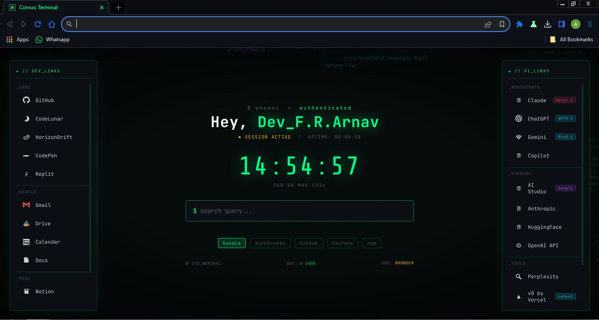

# ⬡ Corvus — Terminal Browser Extensions

> *A dark terminal-themed Chrome extension suite by **Dev_F.R.Arnav***.  
> Custom new tab page + matching browser theme — built for developers who live in the terminal.

---

```
$ whoami → authenticated
Hey, Dev_F.R.Arnav_
```

---

## 📦 What's Inside

```
corvus-extensions/
├── corvus-extension/     ← New Tab Page (Manifest V3)
└── corvus-theme/         ← Browser UI Theme  (Manifest V2)
```

Both are standalone extensions — install one or both.

---

## ✨ Features

### 🖥️ Corvus: Terminal — New Tab Page

| Feature | Details |
|---|---|
| **Live Code Rain** | Animated background of real dev code snippets cascading down the screen |
| **Live Clock** | Large real-time HH:MM:SS display with date |
| **Session Uptime** | Counts up from the moment the tab is opened |
| **Real Battery %** | Live battery level with ⚡ charging indicator, colour-coded green/amber/red |
| **Smart Search** | Detects URLs, domains, and search queries automatically |
| **5 Search Engines** | Google · DuckDuckGo · GitHub · YouTube · npm |
| **Dev Links Panel** | Left panel — GitHub, Stack Overflow, CodePen, Replit, Gmail, Drive, Calendar, Docs, Notion, Figma, Discord |
| **AI Links Panel** | Right panel — Claude, ChatGPT, Gemini, Copilot, AI Studio, Anthropic Console, HuggingFace, OpenAI API, Perplexity, v0, Midjourney, Cursor |
| **Custom Greeting** | Double-click your name to personalise it — saved permanently |
| **CRT Aesthetic** | Scanlines + vignette overlay for that authentic terminal feel |

### 🎨 Corvus // Terminal Theme

- **Pure black frame** — `#0a0c0f` browser chrome  
- **Dark toolbar** — `#0d1117` address bar and tab strip  
- **Green active tab** text — matches the terminal palette  
- **Dimmed inactive tabs** — clean, uncluttered look  
- **Purple incognito mode** — distinct deep violet frame when browsing privately  
- **Dimmed inactive window** — frame darkens when Corvus loses focus  

---

## 🚀 Installation

### Prerequisites
- **Chrome**, **Chromium**, or any Chromium-based browser (Thorium, Brave, etc.)
- Developer Mode enabled

---

### Step 1 — Enable Developer Mode

Open your browser and go to:
```
chrome://extensions/
```
Toggle **Developer Mode** ON (top-right corner).

---

### Step 2 — Install the New Tab Extension

1. Click **Load unpacked**
2. Select the `corvus-extension/` folder
3. Open a new tab — done ✓

> 💡 **Set your name:** Double-click your name in the greeting to personalise it. It saves automatically.

---

### Step 3 — Install the Browser Theme *(optional)*

> ⚠️ **Important:** The theme uses Manifest V2.

1. Go to `chrome://extensions/`
2. Click **Load unpacked**
3. Select the `corvus-theme/` folder
4. Theme applies instantly

**To verify or remove the theme:**
```
chrome://settings/appearance
```
You'll see **"Corvus // Terminal Theme"** with a Reset button.

**To remove:**  
`chrome://settings/appearance` → **Reset to default**  
Then go to `chrome://extensions/` → find Corvus Theme → **Remove**

---
## 🖼️ Preview


---

## 🗂️ File Structure

```
corvus-extensions/
│
├── corvus-extension/
│   ├── index.html          # Full new tab UI + all CSS
│   ├── main.js             # Canvas rain, clock, battery, search, name
│   ├── manifest.json       # MV3 — new tab override
│   └── icons/
│       ├── icon16.png
│       ├── icon32.png
│       ├── icon48.png
│       └── icon128.png
│
└── corvus-theme/
    ├── manifest.json       # MV2 — required for themes
    ├── images/
    │   ├── theme_frame.png
    │   ├── theme_frame_inactive.png
    │   ├── theme_frame_incognito.png
    │   ├── theme_frame_incognito_inactive.png
    │   ├── theme_toolbar.png
    │   ├── theme_tab_background_v.png
    │   └── theme_ntp_background.png
    └── icons/
        ├── icon16.png
        ├── icon48.png
        └── icon128.png
```

---

## 🛠️ Tech Stack

- **Vanilla JS** — zero dependencies, zero frameworks
- **HTML5 Canvas** — live animated code rain background
- **Web Battery API** — real battery status
- **localStorage** — persistent name saves
- **Chrome Extension APIs** — Manifest V3 (extension) + V2 (theme)
- **JetBrains Mono** + **Share Tech Mono** — fonts loaded via Google Fonts

---

## 🎨 Colour Palette

| Name | Hex | Use |
|---|---|---|
| Terminal Black | `#0a0c0f` | Background / browser frame |
| Dark Surface | `#0d1117` | Panels / toolbar |
| Terminal Green | `#00ff88` | Accent / active elements |
| Cyan | `#00e5ff` | Code rain accent |
| Amber | `#ffb700` | Warnings / status |
| Purple | `#bf5fff` | Tags / incognito accent |
| Void Purple | `#7b2fff` | Incognito browser frame |
| Text | `#c9d1d9` | Body text |
| Dim | `#586069` | Inactive / secondary text |

---

## ⌨️ Keyboard Shortcuts

| Key | Action |
|---|---|
| Any letter key | Auto-focuses the search bar |
| `Enter` | Search / navigate (opens in new tab) |
| `Double-click name` | Edit your greeting name |

---

## 🌐 Browser Compatibility

| Browser | New Tab Extension | Theme |
|---|---|---|
| Chrome 88+ | ✅ | ✅ |
| Thorium | ✅ | ✅ |
| Brave | ✅ | ✅ |
| Chromium | ✅ | ✅ |
| Edge | ✅ | ⚠️ Partial |
| Firefox | ❌ | ❌ |

---

## 👤 Author

**Dev_F.R.Arnav**  
Built with 🖤 and too many late-night terminal sessions.

---

## 📄 License

MIT — use it, fork it, make it yours.

---

*Part of the **Corvus Browser** project — a full Rust-based terminal browser.*
